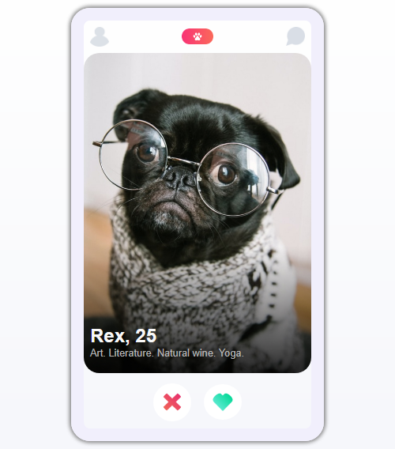

## Tindog Solo Project

This is a solution to the [Scrimba TinDog Solo Project](https://scrimba.com/allcourses).

## Table of contents

- [Overview](#overview)
  - [The challenge](#the-challenge)
  - [Screenshot](#screenshot)
  - [Links](#links)
- [My process](#my-process)
  - [Built with](#built-with)
  - [What I learned](#what-i-learned)
- [Author](#author)
- [Acknowledgments](#acknowledgments)

## Overview

  Users will be able to:

- show their reactions regarding a dog
- a click on heart icon should display "Like"
- a click on cross icon should display "Nope"
- the number of like dog should be displayed at the end.

### Screenshot



### Links

- Solution URL: [github.com/Ifescohub/tinDog](https://github.com/Ifescohub/tinDog)
- Live Site URL: [https://tindog-d076fc.netlify.app/](https://tindog-d076fc.netlify.app/)

## My process

### Built with

- HTML5 markup
- Pure CSS
- Vanilla JavaScript
- Flexbox

### What I learned

I learnt a lot through this project. I was able to use Javascript class constructor function to assign object and render html templates.

```js
class Dog {
    constructor(data) {
        Object.assign(this, data);
     
    }

    renderDogs(){
        const { name, avatar, age, bio } = this;

        return `
            <picture class="dog-img">
                
            </picture>
            <div class="description">
                <h2>${name}, ${age}</h2>
                <p>${bio}</p>
            </div>
            `;
    };
}

```


## Author

- GitHub - [Udeh Ifeanyi](https://github.com/Ifescohub)
- Frontend Mentor - [@ifescohub](https://www.frontendmentor.io/profile/Ifescohub)
- Twitter - [@UdehIfeanyi10](https://twitter.com/UdehIfeanyi10)

## Acknowledgments

I acknowledge scrimba tutors for creating a solo project challenge like this to help learnings apply what they are learning. 
You can also learn from Scrimba. Check the Links below.

- [Scrimba courses](https://scrimba.com/allcourses)
- [The Frontend Career Path](https://scrimba.com/learn/frontend)
- [Become a Scrimba Pro member](https://scrimba.com/pricing)

Happy Coding!

